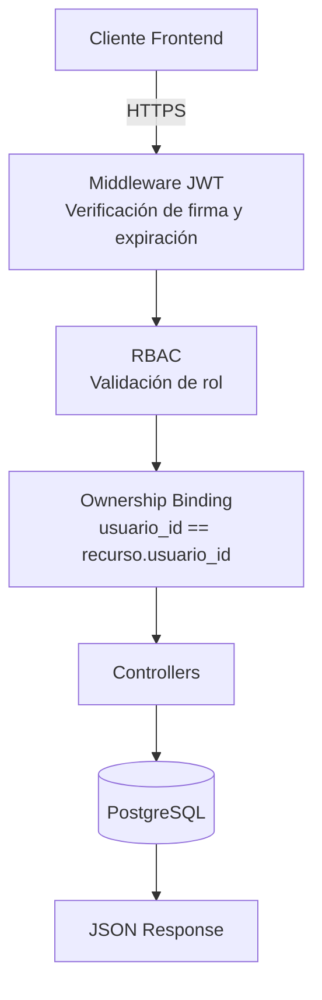

# **Lab_Backend_Catastro**

Esquema de control de acceso basado en JWT para mitigar Broken Object Level Authorization Estudio de caso: backend del Portal de Catastro de Cochabamba

## 📌 Contexto

Este repositorio es el entorno de laboratorio controlado desarrollado como parte de una monografía de grado que evalúa un esquema de control de acceso basado 
en JWT + RBAC + Ownership Binding para mitigar la vulnerabilidad Broken Object Level Authorization (BOLA), identificada según la clasificación OWASP API 
Security Top 10.

El diagnóstico inicial (realizado con autorización formal de la institución) detectó que el backend original del portal de Catastro Cochabamba exponía
públicamente, sin ningún tipo de autenticación ni validación de sesión, los siguientes endpoints:

| Endpoint | Método | Riesgo detectado |
|----------|---------|------------------|
| `/api/v1/usuarios` | GET | Exposición de la base de usuarios (nombres, login y rol). |
| `/api/v1/usuariosFuncionarios` | GET | Exposición de información del personal municipal. |
| `/api/v1/predios/{id}` | GET | Acceso a datos técnicos, legales y geográficos manipulando el parámetro `{id}`. |

Este proyecto replica esa arquitectura en un entorno de prueba aislado para diseñar, implementar y validar una contramedida, sin intervenir 
en ningún momento sobre el sistema en producción de la institución.

## 🏗️ Arquitectura



## Stack técnico:

Node.js + Express — servidor y enrutamiento de la API REST
PostgreSQL — persistencia de usuarios, funcionarios y predios
JSON Web Tokens (jsonwebtoken) — emisión y verificación de tokens firmados
Postman — interceptación, réplica y validación manual de peticiones durante las pruebas
Estructura del token JWT
Claim	Propósito
id	Identificador del usuario; se contrasta contra usuario_id del recurso para el Ownership Binding
nombres, login	Trazabilidad y auditoría de sesión
tipoUsuario	Rol del usuario, usado para el filtrado RBAC de rutas
exp	Expiración del token, para invalidar sesiones robadas

## 🚀 Puesta en marcha

### 1. Clonar el repositorio

```bash
git clone https://github.com/AleMonCayola/Lab_Backend_Catastro.git
cd Lab_Backend_Catastro
```

### 2. Instalar dependencias

```bash
npm install
```

### 3. Configurar variables de entorno

```bash
cp .env.example .env
```

Completar:

- PostgreSQL
- JWT_SECRET
- SEGURIDAD_JWT

### 4. Iniciar el servidor

```bash
npm start
```


## 👤 Autor

Alejandro Montaño Cayola GitHub: @AleMonCayola
